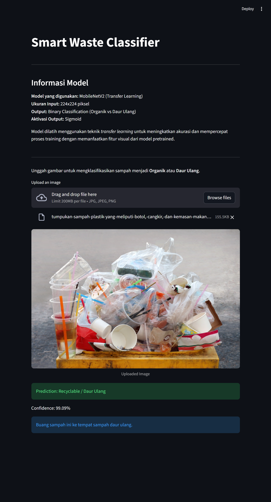
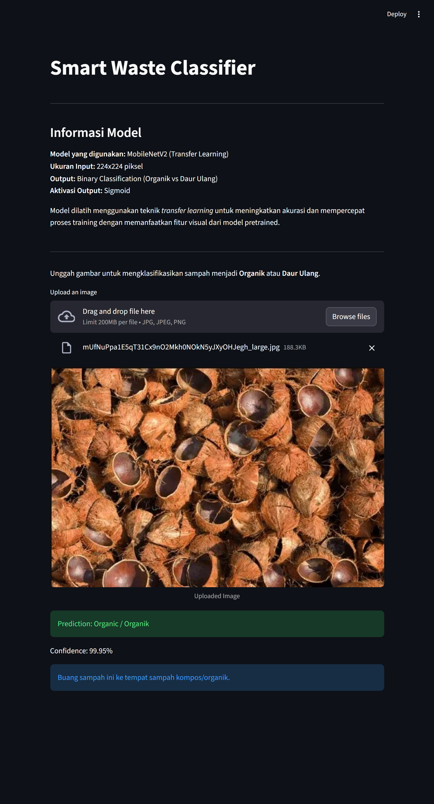

# Smart Waste Classifier

Smart Waste Classifier adalah aplikasi berbasis Computer Vision untuk mengklasifikasikan sampah menjadi:

- Organic (Organik)
- Recyclable (Daur Ulang)

Model dibangun menggunakan teknik **Transfer Learning** dan di-deploy menggunakan **Streamlit**.




## Project Overview

Project ini membandingkan dua arsitektur pretrained:

- MobileNetV2
- EfficientNetB0

Keduanya dilatih ulang (transfer learning) untuk tugas klasifikasi biner pada dataset:

> Waste Classification Dataset (Techsash - Kaggle)

Model terbaik (MobileNetV2) dipilih berdasarkan performa pada test set dan disimpan sebagai `best_model.h5`.

---

## Model Architecture

- Base Model: MobileNetV2
- Input Size: 224x224
- GlobalAveragePooling2D
- Dense (128, ReLU)
- Dropout (0.3)
- Output: 1 neuron (Sigmoid)

Loss Function: Binary Crossentropy  
Optimizer: Adam (1e-4)

---

## Project Structure

```
├── dataset/
├── waste_experiment.ipynb
├── app.py
├── best_model.h5
├── requirements.txt
├── efficientnet_best.h5
├── mobilenet_best.h5
└── README.md
```

---

## Run Training (Notebook)

Jalankan file:

waste_experiment.ipynb

---

## Run Streamlit App

Install dependencies:
```bash
pip install -r requirements.txt
```

Jalankan:

```bash
streamlit run app.py

```

Upload gambar sampah dan model akan mengklasifikasikan menjadi:

- Organic
- Recyclable

Disertai confidence score dan disposal guidance.

---

## Tech Stack

- Python
- TensorFlow / Keras
- OpenCV
- Streamlit
- Scikit-learn
- Matplotlib & Seaborn

---

## Future Improvements

- Fine-tuning deeper layers
- Class weighting untuk mengurangi bias kelas
- Real-time webcam classification
- Multi-class waste detection

---

## Dataset

Waste Classification Dataset (Techsash - Kaggle)